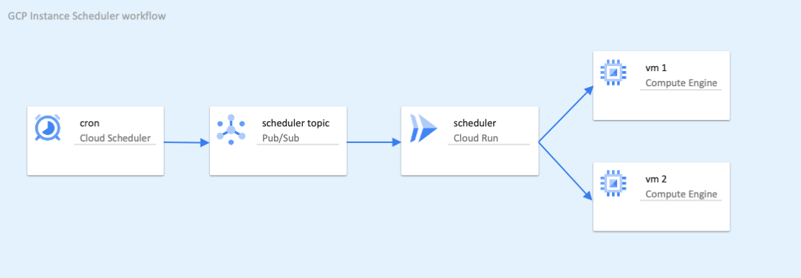

# GCP Instance Scheduler

Simple instance scheduler for Google Cloud that can be used in any container platform (e.g. Cloud Run or GKE), can be scheduled to run by e.g. Cloud Scheduler or Kubernetes CronJob, and instance schedules can be controlled by instance labels with crontab-like capabilities.



## Create the container image

`scheduler` directory contains the code for the scheduler container and Terraform template to create a GCP Artifact repository.  If you don't already have a repository available, you can
modify the `tfvars` example with your own content and run the Terraform templates to create one:

```hashicorp
$ terraform apply

An execution plan has been generated and is shown below.
Resource actions are indicated with the following symbols:
  + create

Terraform will perform the following actions:

  # google_artifact_registry_repository.repo will be created
  + resource "google_artifact_registry_repository" "repo" {
      + create_time   = (known after apply)
      + description   = "GCP Instance Scheduler Repository"
      + format        = "DOCKER"
      + id            = (known after apply)
      + location      = "europe-west3"
      + name          = (known after apply)
      + project       = (known after apply)
      + repository_id = "gcp-scheduler-repo"
      + update_time   = (known after apply)
    }

  # google_project_service.repo will be created
  + resource "google_project_service" "repo" {
      + disable_on_destroy = true
      + id                 = (known after apply)
      + project            = "pojala-gcp-playground"
      + service            = "artifactregistry.googleapis.com"
    }

Plan: 2 to add, 0 to change, 0 to destroy.

Changes to Outputs:
  + repository_url = "europe-west3-docker.pkg.dev/pojala-gcp-playground/gcp-scheduler-repo"

Do you want to perform these actions?
  Terraform will perform the actions described above.
  Only 'yes' will be accepted to approve.

  Enter a value: yes

google_project_service.repo: Creating...
google_project_service.repo: Still creating... [10s elapsed]
google_project_service.repo: Still creating... [20s elapsed]
google_project_service.repo: Creation complete after 26s [id=pojala-gcp-playground/artifactregistry.googleapis.com]
google_artifact_registry_repository.repo: Creating...
google_artifact_registry_repository.repo: Still creating... [10s elapsed]
google_artifact_registry_repository.repo: Creation complete after 12s [id=projects/pojala-gcp-playground/locations/europe-west3/repositories/gcp-scheduler-repo]

Apply complete! Resources: 2 added, 0 changed, 0 destroyed.

Outputs:

repository_url = "europe-west3-docker.pkg.dev/pojala-gcp-playground/gcp-scheduler-repo"
```

Build the container with a tag referencing your repository, e.g.

```bash
$ docker build ./ -t europe-west3-docker.pkg.dev/pojala-gcp-playground/gcp-scheduler-repo/gcp_instance_scheduler:latest
Sending build context to Docker daemon  203.4MB
Step 1/9 : FROM golang:1.14 AS builder
1.14: Pulling from library/golang
6c33745f49b4: Pull complete
ef072fc32a84: Pull complete
c0afb8e68e0b: Pull complete
d599c07d28e6: Pull complete
c616e0dda35f: Pull complete
3e632de71d89: Pull complete
29116063284d: Pull complete
Digest: sha256:34e2b87146b59fa62de329e6cf766a0866707533d48bbcee8b2269cabf878b9c
Status: Downloaded newer image for golang:1.14
 ---> ae11962d94b7
Step 2/9 : WORKDIR /build
 ---> Running in d66f0bf99d72
Removing intermediate container d66f0bf99d72
 ---> 0d6e62fc993c
Step 3/9 : COPY scheduler.go .
 ---> a163ba134d5f
Step 4/9 : RUN go get -d -v ./...
 ---> Running in d90be934cda2
...
Removing intermediate container d90be934cda2
 ---> d8d93a14ce22
Step 5/9 : RUN CGO_ENABLED=0 GOOS=linux go build -ldflags="-s -w" -a -o scheduler
 ---> Running in 7b56162c0d52
Removing intermediate container 7b56162c0d52
 ---> 5da12ce83939
Step 6/9 : FROM gcr.io/google.com/cloudsdktool/cloud-sdk:alpine AS final
alpine: Pulling from google.com/cloudsdktool/cloud-sdk
05e7bc50f07f: Pull complete
902938da4d80: Pull complete
29db5ebd53be: Pull complete
6f7f9abaa587: Pull complete
Digest: sha256:03606d407f0e5f0cbcea9a2d7c25e10d5214cc6f3f919ee60620a07a9355a773
Status: Downloaded newer image for gcr.io/google.com/cloudsdktool/cloud-sdk:alpine
 ---> e65e2e589d28
Step 7/9 : WORKDIR /
 ---> Running in 89eb2ba31010
Removing intermediate container 89eb2ba31010
 ---> 481743d503a9
Step 8/9 : COPY --from=builder /build/scheduler .
 ---> 90a9fac3c88f
Step 9/9 : CMD [ "./scheduler" ]
 ---> Running in b1f3d5386b8b
Removing intermediate container b1f3d5386b8b
 ---> 17529eb0ad8a
Successfully built 17529eb0ad8a
Successfully tagged europe-west3-docker.pkg.dev/pojala-gcp-playground/gcp-scheduler-repo/gcp_instance_scheduler:latest
```

Configure docker to authorize with gcloud:

```bash
$ gcloud auth configure-docker europe-west3-docker.pkg.dev
Adding credentials for: europe-west3-docker.pkg.dev
After update, the following will be written to your Docker config file
 located at [/Users/ojala/.docker/config.json]:
 {
  "credHelpers": {
    "europe-west3-docker.pkg.dev": "gcloud"
  }
}

Do you want to continue (Y/n)?  y

Docker configuration file updated.
```

And finally, push the image to the GCP Repository:

```bash
$ docker push europe-west3-docker.pkg.dev/pojala-gcp-playground/gcp-scheduler-repo/gcp_instance_scheduler
Using default tag: latest
The push refers to repository [europe-west3-docker.pkg.dev/pojala-gcp-playground/gcp-scheduler-repo/gcp_instance_scheduler]
05667cf60bf0: Pushed
a51bd180acb8: Pushed
6c59e8ce38f7: Pushed
392d733a90ad: Pushed
f4666769fca7: Pushed
latest: digest: sha256:9a6af5acf827fd23a622b71748937f90c1e026d8036035035386077ecf15f3bd size: 1371
```

## Terraform templates for Cloud Scheduler and Cloud Run

The example Terraform templates in `deploy` directory deploy the scheduler into Cloud Run with a Cloud Scheduler to trigger the container every 15 minutes through a Pub/Sub topic.

`demo.auto.tfvars` is an example configuration, `gcp` object defines the GCP ceredentials and `scheduler` has the details for Cloud Run container, Cloud Scheduler configuration, and the Service Accounts for both.  Projects and zones where the scheduler is used are defined in `env` object.

`cloud-run.tf` declares the Cloud Run service, `cloud-scheduler.tf` the Cloud Scheduler to execute the container periodically, and `service-account.tf` the Service Accounts for both services.  Cloud Run container needs permissions to create and manage the Cloud Run service and to access the projects to list zones and list, start and stop instances.  Cloud Scheduler needs permissions to invoke the Cloud Run service.

To deploy, simply run `terraform init` followed by `terraform apply`:

<details><summary>Click to see Terraform output</summary>
<p>

```bash
$ terraform init

Initializing the backend...

Initializing provider plugins...
- Finding hashicorp/random versions matching "~> 3.0.0"...
- Finding hashicorp/null versions matching "~> 3.0.0"...
- Finding hashicorp/google versions matching "~> 3.51"...
- Finding hashicorp/google-beta versions matching "~> 3.51"...
- Installing hashicorp/null v3.0.0...
- Installed hashicorp/null v3.0.0 (signed by HashiCorp)
- Installing hashicorp/google v3.51.0...
- Installed hashicorp/google v3.51.0 (signed by HashiCorp)
- Installing hashicorp/google-beta v3.51.0...
- Installed hashicorp/google-beta v3.51.0 (signed by HashiCorp)
- Installing hashicorp/random v3.0.0...
- Installed hashicorp/random v3.0.0 (signed by HashiCorp)

Terraform has created a lock file .terraform.lock.hcl to record the provider
selections it made above. Include this file in your version control repository
so that Terraform can guarantee to make the same selections by default when
you run "terraform init" in the future.

Terraform has been successfully initialized!
```

```bash
$ terraform apply

An execution plan has been generated and is shown below.
Resource actions are indicated with the following symbols:
  + create

Terraform will perform the following actions:

  # google_cloud_run_service.scheduler will be created
  + resource "google_cloud_run_service" "scheduler" {
      + autogenerate_revision_name = false
      + id                         = (known after apply)
      + location                   = "europe-west3"
      + name                       = "gcp-instance-scheduler"
      + project                    = (known after apply)
      + status                     = (known after apply)

      + metadata {
          + annotations      = (known after apply)
          + generation       = (known after apply)
          + labels           = (known after apply)
          + namespace        = (known after apply)
          + resource_version = (known after apply)
          + self_link        = (known after apply)
          + uid              = (known after apply)
        }

      + template {
          + metadata {
              + annotations      = {
                  + "autoscaling.knative.dev/maxScale" = "1"
                }
              + generation       = (known after apply)
              + name             = (known after apply)
              + namespace        = (known after apply)
              + resource_version = (known after apply)
              + self_link        = (known after apply)
              + uid              = (known after apply)
            }

          + spec {
              + container_concurrency = (known after apply)
              + service_account_name  = (known after apply)
              + serving_state         = (known after apply)
              + timeout_seconds       = (known after apply)

              + containers {
                  + image = "europe-west3-docker.pkg.dev/pojala-gcp-playground/gcp-scheduler-repo/gcp_instance_scheduler"

                  + env {
                      + name  = "scheduler_projects"
                      + value = "pojala-gcp-playground"
                    }
                  + env {
                      + name  = "scheduler_zones"
                      + value = "europe"
                    }
                  + env {
                      + name  = "verbose"
                      + value = "true"
                    }

                  + ports {
                      + container_port = (known after apply)
                      + name           = (known after apply)
                      + protocol       = (known after apply)
                    }

                  + resources {
                      + limits   = (known after apply)
                      + requests = (known after apply)
                    }
                }
            }
        }

      + traffic {
          + latest_revision = true
          + percent         = 100
        }
    }

  # google_cloud_run_service_iam_member.run will be created
  + resource "google_cloud_run_service_iam_member" "run" {
      + etag     = (known after apply)
      + id       = (known after apply)
      + location = "europe-west3"
      + member   = (known after apply)
      + project  = (known after apply)
      + role     = "roles/run.admin"
      + service  = "gcp-instance-scheduler"
    }

  # google_cloud_run_service_iam_member.scheduler will be created
  + resource "google_cloud_run_service_iam_member" "scheduler" {
      + etag     = (known after apply)
      + id       = (known after apply)
      + location = "europe-west3"
      + member   = (known after apply)
      + project  = (known after apply)
      + role     = "roles/run.invoker"
      + service  = "gcp-instance-scheduler"
    }

  # google_cloud_scheduler_job.scheduler will be created
  + resource "google_cloud_scheduler_job" "scheduler" {
      + attempt_deadline = "320s"
      + description      = "Instance Scheduler"
      + id               = (known after apply)
      + name             = "instance-scheduler"
      + project          = (known after apply)
      + region           = "europe-west3"
      + schedule         = "*/15 * * * *"
      + time_zone        = "Europe/Helsinki"

      + http_target {
          + http_method = "GET"
          + uri         = (known after apply)

          + oidc_token {
              + service_account_email = (known after apply)
            }
        }
    }

  # google_project_iam_custom_role.run_compute_engine["pojala-gcp-playground"] will be created
  + resource "google_project_iam_custom_role" "run_compute_engine" {
      + deleted     = (known after apply)
      + description = "Instance Scheduler"
      + id          = (known after apply)
      + name        = (known after apply)
      + permissions = [
          + "compute.instances.list",
          + "compute.instances.start",
          + "compute.instances.stop",
          + "compute.zones.list",
        ]
      + project     = "pojala-gcp-playground"
      + role_id     = "instance_scheduler"
      + stage       = "GA"
      + title       = "Instance Scheduler"
    }

  # google_project_iam_member.run_compute_engine["pojala-gcp-playground"] will be created
  + resource "google_project_iam_member" "run_compute_engine" {
      + etag    = (known after apply)
      + id      = (known after apply)
      + member  = (known after apply)
      + project = "pojala-gcp-playground"
      + role    = (known after apply)
    }

  # google_project_service.scheduler will be created
  + resource "google_project_service" "scheduler" {
      + disable_on_destroy = true
      + id                 = (known after apply)
      + project            = "pojala-gcp-playground"
      + service            = "cloudscheduler.googleapis.com"
    }

  # google_service_account.run will be created
  + resource "google_service_account" "run" {
      + account_id   = "instance-scheduler-run"
      + description  = "GCP Instance Scheduler Cloud Run SA"
      + display_name = "GCP Instance Scheduler Cloud Run"
      + email        = (known after apply)
      + id           = (known after apply)
      + name         = (known after apply)
      + project      = (known after apply)
      + unique_id    = (known after apply)
    }

  # google_service_account.scheduler will be created
  + resource "google_service_account" "scheduler" {
      + account_id   = "instance-scheduler"
      + description  = "GCP Instance Scheduler SA"
      + display_name = "GCP Instance Scheduler"
      + email        = (known after apply)
      + id           = (known after apply)
      + name         = (known after apply)
      + project      = (known after apply)
      + unique_id    = (known after apply)
    }

Plan: 9 to add, 0 to change, 0 to destroy.

Changes to Outputs:
  + url = (known after apply)

Do you want to perform these actions?
  Terraform will perform the actions described above.
  Only 'yes' will be accepted to approve.

  Enter a value: yes

google_project_service.scheduler: Creating...
google_service_account.scheduler: Creating...
google_project_iam_custom_role.run_compute_engine["pojala-gcp-playground"]: Creating...
google_service_account.run: Creating...
google_service_account.scheduler: Creation complete after 3s [id=projects/pojala-gcp-playground/serviceAccounts/instance-scheduler@pojala-gcp-playground.iam.gserviceaccount.com]
google_service_account.run: Creation complete after 3s [id=projects/pojala-gcp-playground/serviceAccounts/instance-scheduler-run@pojala-gcp-playground.iam.gserviceaccount.com]
google_cloud_run_service.scheduler: Creating...
google_project_iam_custom_role.run_compute_engine["pojala-gcp-playground"]: Creation complete after 5s [id=projects/pojala-gcp-playground/roles/instance_scheduler]
google_project_iam_member.run_compute_engine["pojala-gcp-playground"]: Creating...
google_project_service.scheduler: Still creating... [10s elapsed]
google_cloud_run_service.scheduler: Still creating... [10s elapsed]
google_cloud_run_service.scheduler: Creation complete after 10s [id=locations/europe-west3/namespaces/pojala-gcp-playground/services/gcp-instance-scheduler]
google_cloud_run_service_iam_member.scheduler: Creating...
google_cloud_run_service_iam_member.run: Creating...
google_project_iam_member.run_compute_engine["pojala-gcp-playground"]: Still creating... [10s elapsed]
google_project_iam_member.run_compute_engine["pojala-gcp-playground"]: Creation complete after 13s [id=pojala-gcp-playground/projects/pojala-gcp-playground/roles/instance_scheduler/serviceaccount:instance-scheduler-run@pojala-gcp-playground.iam.gserviceaccount.com]
google_project_service.scheduler: Still creating... [20s elapsed]
google_cloud_run_service_iam_member.scheduler: Still creating... [10s elapsed]
google_cloud_run_service_iam_member.run: Still creating... [10s elapsed]
google_cloud_run_service_iam_member.scheduler: Creation complete after 12s [id=v1/projects/pojala-gcp-playground/locations/europe-west3/services/gcp-instance-scheduler/roles/run.invoker/serviceaccount:instance-scheduler@pojala-gcp-playground.iam.gserviceaccount.com]
google_cloud_run_service_iam_member.run: Creation complete after 13s [id=v1/projects/pojala-gcp-playground/locations/europe-west3/services/gcp-instance-scheduler/roles/run.admin/serviceaccount:instance-scheduler-run@pojala-gcp-playground.iam.gserviceaccount.com]
google_project_service.scheduler: Creation complete after 26s [id=pojala-gcp-playground/cloudscheduler.googleapis.com]
google_cloud_scheduler_job.scheduler: Creating...
google_cloud_scheduler_job.scheduler: Creation complete after 1s [id=projects/pojala-gcp-playground/locations/europe-west3/jobs/instance-scheduler]

Apply complete! Resources: 9 added, 0 changed, 0 destroyed.

Outputs:

url = "https://gcp-instance-scheduler-omer5z3qza-ey.a.run.app"
```

</p>
</details>

If `verbose` option is enabled for the container, it will show details for instances and schedules.  If verbose is not enabled, only instance start/stop actions are being logged.  You can see the logs in GCP Console, or using `gcloud logging` command, e.g.

```bash
$ gcloud logging read "resource.type=cloud_run_revision AND resource.labels.service_name=gcp-instance-scheduler" --project pojala-gcp-playground --format 'value(timestamp, textPayload)' --limit 20
2020-12-30T09:54:22.216393Z
2020-12-30T09:54:21.207639Z	next_schedule=2020-12-30 18:00:00 +0000 UTC
2020-12-30T09:54:21.207634Z	crontab=0 18 * * *
2020-12-30T09:54:21.207628Z	next_schedule=2020-12-30 12:00:00 +0000 UTC
2020-12-30T09:54:21.207611Z	crontab=0 12 * * *
2020-12-30T09:54:21.207605Z	zone=europe-north1-a instance=linux-vm-2 labels=map[install_nginx: install_stackdriver: schedule_end:hour18 schedule_start:hour12]
2020-12-30T09:54:21.207598Z	next_schedule=2020-12-30 16:00:00 +0000 UTC
2020-12-30T09:54:21.207592Z	crontab=0 16 * * *
2020-12-30T09:54:21.207584Z	next_schedule=2020-12-31 06:00:00 +0000 UTC
2020-12-30T09:54:21.207553Z	crontab=0 06 * * *
2020-12-30T09:54:21.207528Z	zone=europe-north1-a instance=linux-vm-1 labels=map[install_nginx: install_stackdriver: schedule_end:hour16 schedule_start:hour06]
2020-12-30T09:54:18.665872Z	current_time=2020-12-30 09:54:18.665743442 +0000 UTC current_time_zone=UTC
2020-12-30T09:54:18.344680Z	project=pojala-gcp-playground
2020-12-30T09:53:11.383074Z
2020-12-30T09:53:09.867165Z	stop instance linux-vm-2 (europe-north1-a)
2020-12-30T09:53:09.867159Z	next_schedule=2020-12-30 18:00:00 +0000 UTC
2020-12-30T09:53:09.867154Z	crontab=0 18 * * *
2020-12-30T09:53:09.867141Z	next_schedule=2020-12-30 12:00:00 +0000 UTC
2020-12-30T09:53:09.867134Z	crontab=0 12 * * *
2020-12-30T09:53:09.867124Z	zone=europe-north1-a instance=linux-vm-2 labels=map[install_nginx: install_stackdriver: schedule_end:hour18 schedule_start:hour12]
2020-12-30T09:53:09.867105Z	next_schedule=2020-12-30 16:00:00 +0000 UTC
2020-12-30T09:53:09.867060Z	crontab=0 16 * * *
2020-12-30T09:53:09.867045Z	next_schedule=2020-12-31 06:00:00 +0000 UTC
2020-12-30T09:53:09.867003Z	crontab=0 06 * * *
2020-12-30T09:53:09.866919Z	zone=europe-north1-a instance=linux-vm-1 labels=map[install_nginx: install_stackdriver: schedule_end:hour16 schedule_start:hour06]
2020-12-30T09:53:07.289515Z	current_time=2020-12-30 09:53:07.289138393 +0000 UTC current_time_zone=UTC
2020-12-30T09:53:06.749025Z	project=pojala-gcp-playground
```
_(Update with better example..)_

## Configuration

The container require two mandatory environment variables, `scheduler_projects` and `scheduler_zones`.

`scheduler_projects` is a comma-separated list of GCP projects to check instances.  When you deploy the scheduler, make sure that the container has required access to these projects.

`shceduler_zones` is a comma-separated list of prefixes for GCP Regions.  For example if you want to check through all regions in the US, one could use `us`.  For a more specific
region one could define just `europe-west` or `europe-west3`.  If you deploy instances only to a single region, it is recommended to list it precisely.

Two optional environment variables are available, `scheduler_start_label` and `scheduler_end_label` that define the VM instance label to search for.  By default these are `schedule_start` and `schedule_end`.

Optional environment variable `debug` can be set to enable more verbose logging.

## Instance labels

`schedule_start` and `schedule_end` labels on the VM instance define the start and stop schedule for the instance.  As the label values do not support the required character set
for cron definition, the label value is a `_` (underscore) separate list of time and date values.

`HHMM` defines a specific hour:minute, e.g. `0830` defines 08:30 in the morning and `2145` defined 21:45 in the evening.  
`HH` defines a specific start of hour, e.g. `06` defines 06:00.

`monfri` or `workday` defines weekdays from Monday to Friday (1-5).  
`satsun` or `weekend` defines weekend, Saturday and Sunday (0,6).

`dayNN` defines NN day of the month.  
`hourNN` defines hour of the day.  
`minNN` defines NN min of the month.

`mon`, `tue`, `wed`, `thu`, `fri`, `sat` and `sun` can be used to define a specific day of the week.  
`jan`, `feb`, `mar`, `apr`, `may`, `jun`, `jul`, `aug`, `sep`, `oct`, `nov` and `dec` can be used to define a specific month of the year.

### Examples

`0800_day1_jan_apr_jul_oct` would define `0 8 1 1,4,7,10 *` to run the schedule beginning of each quarter.

`06_workday` would define `0 6 * * 1-5` to run the schedule at 6:00 am every working day (Monday to Friday).

For example to schedule an instance to run between 06:30 and 18:00 every working day, one would define `0630_workday` as the start schedule and `1800_workday` or `18_workday` as the stop schedule.

If you are not familiar with cron scheduler syntax, please see https://en.wikipedia.org/wiki/Cron
